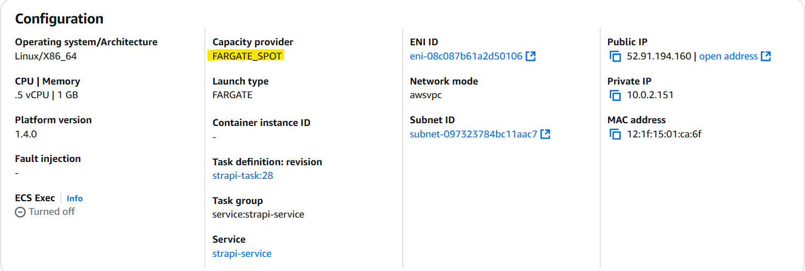
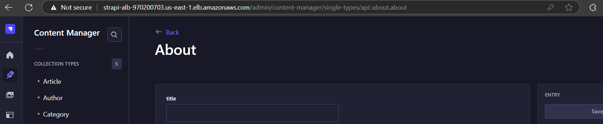
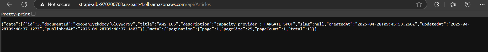

# Task_9_

Deploy the strapi application on ECS FARGATE_SPOT and Use the public URL (e.g., http://<alb-dns-name>/api/[your-endpoint]) to test APIs or connect a frontend.

I have successfully deployed and published a Strapi application on AWS ECS Fargate_spot using Terraform for infrastructure provisioning and GitHub Actions for CI/CD automation.

✅ Key Highlights:

*Deployment Stack:

-Dockerized Strapi app image pushed to Amazon ECR

-ECS Fargate_spot used for running the container

-Application Load Balancer (ALB) exposed the Strapi admin panel & API

*Environment Setup:

-.env used to configure APP_KEYS, ALLOWED_HOSTS, etc.

-ALB DNS mapped as APP_URL for Strapi

-CloudWatch used for ECS task logging

*Publishing Content:

-Created Collection Types Article in Strapi Admin. Also created Single Types (Date1)

-Configured Public Role Permissions to allow unauthenticated access to API endpoints.

-Published content directly from the admin dashboard

*Testing:

-Verified published content via public API endpoint: http://strapi-alb-1913271914.us-east-1.elb.amazonaws.com/api/Articles

*Result:

-Content now accessible publicly via ALB URL with proper permissions. Please find below the screenshots. 

